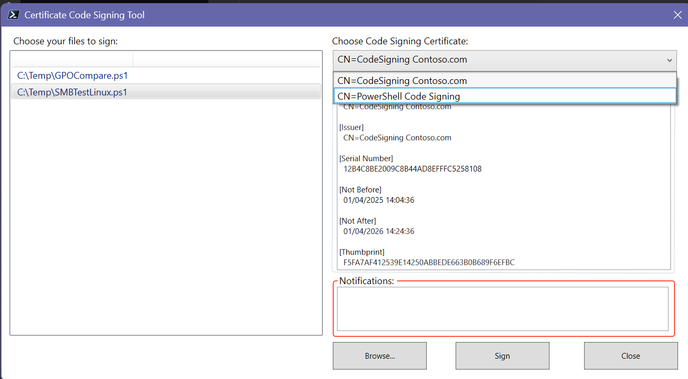
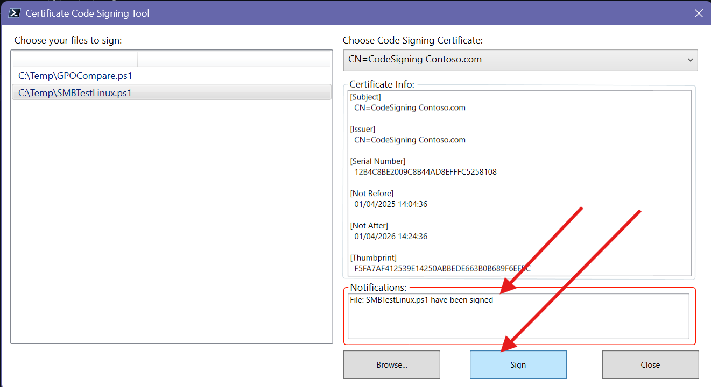
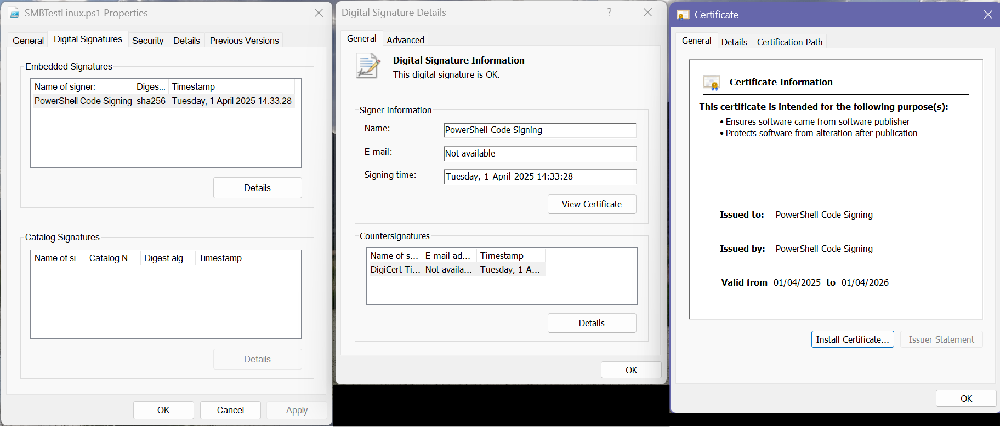

# SignPoshScripts

**Language / Sprache:** **English** | [Deutsch](README.de.md)

[](https://github.com/BetaHydri/SignPoshScripts)
[](https://github.com/BetaHydri/SignPoshScripts)
[](https://github.com/BetaHydri/SignPoshScripts/stargazers)
[](https://github.com/BetaHydri/SignPoshScripts/issues)
[](https://github.com/BetaHydri/SignPoshScripts/commits/SIGNPOWERSHELL)
[](LICENSE)

> **Note:** This repository was formerly named `SignPowershell`.
> Old URLs redirect here automatically.

WPF GUI written in PowerShell to sign your scripts with code-signing
certificates from the Windows certificate store **or** a smart card.

## Features

- Browse and select multiple PowerShell files (`.ps1`, `.psm1`, `.psd1`, `.ps1xml`)
- Discovers code-signing certificates from **both**:
  - `Cert:\CurrentUser\My` (software-based certificates)
  - Smart card readers (Microsoft Smart Card Key Storage Provider)
- Deduplicates certificates and filters out expired ones
- Signs with SHA-256 and timestamps via DigiCert
- Configurable timestamp server (default: DigiCert, changeable via ⚙ button)
- Includes the full certificate chain in the signature

## Timestamp Server

Every Authenticode signature created by this tool includes a
**RFC 3161 timestamp** from a trusted timestamp authority.
The default server is `http://timestamp.digicert.com`.
You can change it by clicking the **⚙** button next to the
Timestamp Server field in the UI.

### Why timestamps matter

A timestamp cryptographically proves **when** the signature was
applied. Without a timestamp, the signature becomes invalid the
moment your code-signing certificate expires. With a timestamp,
Windows continues to trust the signature indefinitely — even after
the certificate has expired — because the timestamp proves the
script was signed while the certificate was still valid.

**In short:** Always use a timestamp server. It costs nothing and
ensures your signed scripts keep working after certificate renewal.

### Common timestamp servers

| Provider | URL |
|---|---|
| DigiCert (default) | `http://timestamp.digicert.com` |
| Sectigo | `http://timestamp.sectigo.com` |
| GlobalSign | `http://timestamp.globalsign.com/tsa/r6advanced1` |
| SSL.com | `http://ts.ssl.com` |

> **Note:** Timestamp servers are public and free. They work with
> any code-signing certificate — whether issued by a public CA,
> an internal enterprise CA, or self-signed.

## Prerequisites

You need at least one valid code-signing certificate in your user
certificate store (`Cert:\CurrentUser\My`) **or** on a connected
smart card.

The certificate's Enhanced Key Usage (EKU) must include:
$\color{red}{\text{Code Signing (1.3.6.1.5.5.7.3.3)}}$

## Files

| File / Folder | Description |
|---|---|
| `SignPS.ps1` | WPF / PowerShell source code |
| `CodeSigningTool.exe` | Standalone executable (compiled from `SignPS.ps1` with [ps2exe](https://github.com/MScholtes/ps2exe)) |
| `images/` | Screenshots used in this README |
| `.vscode/launch.json` | VS Code debug configuration |
| `LICENSE` | MIT license |

## Building the Executable

To recompile the `.exe` after modifying the script:

```powershell
Install-Module -Name ps2exe -Scope CurrentUser -Force
Invoke-PS2EXE -InputFile .\SignPS.ps1 -OutputFile .\CodeSigningTool.exe -NoConsole
```

---

## Trusting the Code-Signing Certificate

After signing your PowerShell scripts, target machines must trust the
code-signing certificate before they will execute signed scripts.
Two things are required on every target machine:

1. The **code-signing certificate** must be in the
   **Trusted Publishers** certificate store.
2. The **root CA certificate** (and any intermediate CA certificates)
   must be in the **Trusted Root Certification Authorities** store.
3. The PowerShell **execution policy** must be set to `AllSigned`
   or `RemoteSigned`.

### Standalone Server (Manual)

#### 1 — Export the Code-Signing Certificate

On the machine where you signed the scripts, export the certificate
to a `.cer` file:

```powershell
# List code-signing certificates
Get-ChildItem Cert:\CurrentUser\My -CodeSigningCert

# Export the certificate (replace the thumbprint)
$cert = Get-ChildItem Cert:\CurrentUser\My\<thumbprint>
Export-Certificate -Cert $cert -FilePath C:\Temp\CodeSigning.cer
```

If your certificate was issued by an internal (enterprise) CA, also
export the root CA certificate from
`Cert:\LocalMachine\Root` or `Cert:\CurrentUser\Root`.

#### 2 — Import Certificates on the Target Machine

Copy the `.cer` files to the target server and run the following
in an **elevated** PowerShell session:

```powershell
# Import the code-signing certificate into Trusted Publishers
Import-Certificate -FilePath C:\Temp\CodeSigning.cer `
    -CertStoreLocation Cert:\LocalMachine\TrustedPublisher

# Import the root CA certificate into Trusted Root CAs
# (skip if using a publicly trusted CA like DigiCert, etc.)
Import-Certificate -FilePath C:\Temp\RootCA.cer `
    -CertStoreLocation Cert:\LocalMachine\Root
```

#### 3 — Set the Execution Policy

```powershell
# Allow only signed scripts
Set-ExecutionPolicy AllSigned -Scope LocalMachine -Force

# --- OR ---
# Allow signed remote scripts, unsigned local scripts
Set-ExecutionPolicy RemoteSigned -Scope LocalMachine -Force
```

#### 4 — Verify

```powershell
# Should return 'Valid'
Get-AuthenticodeSignature -FilePath C:\Scripts\YourScript.ps1 |
    Select-Object -ExpandProperty Status
```

### Active Directory Environment (Group Policy)

In an AD domain you can distribute the certificates and enforce
the execution policy centrally via Group Policy.

#### 1 — Distribute Certificates via GPO

1. Open **Group Policy Management** (`gpmc.msc`).
2. Create or edit a GPO linked to the OU that contains the
   target servers/workstations.
3. Navigate to:<br>
   `Computer Configuration → Policies → Windows Settings →`
   `Security Settings → Public Key Policies`
4. **Trusted Publishers** — right-click → **Import…** →
   select the code-signing certificate (`.cer`).
5. **Trusted Root Certification Authorities** — right-click →
   **Import…** → select the root CA certificate (`.cer`).<br>
   *(Skip if using a publicly trusted CA.)*

After the next Group Policy refresh (`gpupdate /force` or at
next reboot) every computer in scope will trust the certificate.

#### 2 — Enforce Execution Policy via GPO

1. In the same (or a separate) GPO navigate to:<br>
   `Computer Configuration → Policies → Administrative Templates →`
   `Windows Components → Windows PowerShell`
2. Enable **Turn on Script Execution**.
3. Set the policy to **Allow only signed scripts** (`AllSigned`)
   or **Allow local scripts and remote signed scripts**
   (`RemoteSigned`).

> **Note:** The GPO-based execution policy takes precedence over
> locally configured policies. You can verify the effective policy
> and its source with:
>
> ```powershell
> Get-ExecutionPolicy -List
> ```

#### 3 — Verify on a Domain-Joined Machine

```powershell
# Force a Group Policy update
gpupdate /force

# Confirm the certificate is trusted
Get-ChildItem Cert:\LocalMachine\TrustedPublisher

# Confirm the execution policy
Get-ExecutionPolicy -List

# Validate a signed script
Get-AuthenticodeSignature -FilePath \\Server\Share\YourScript.ps1 |
    Select-Object -ExpandProperty Status
```

### Quick Reference — Certificate Stores

| Store Location | Purpose |
|---|---|
| `Cert:\LocalMachine\TrustedPublisher` | Trusted code-signing certificates |
| `Cert:\LocalMachine\Root` | Trusted root CA certificates |
| `Cert:\LocalMachine\CA` | Intermediate CA certificates |
| `Cert:\CurrentUser\My` | Personal certificates (signing machine) |

---

## What Happens When a Signed Script Is Modified?

Authenticode signatures are a cryptographic hash over the entire file
content. If **any** change is made to the script after signing — even
a single character — the signature becomes invalid.

### Behavior by Execution Policy

| Execution Policy | Modified signed script behavior |
|---|---|
| `AllSigned` | **Blocked** — error: "file has been changed since it was signed" |
| `RemoteSigned` | Local files still run (no signature required). Remote files (downloaded / UNC) are blocked |
| `Unrestricted` | Runs, but may prompt a warning for remote files |

### Checking Signature Status

```powershell
Get-AuthenticodeSignature .\YourScript.ps1 | Select-Object Status, StatusMessage
```

| Status | Meaning |
|---|---|
| `Valid` | File has not been modified since signing |
| `HashMismatch` | File was modified after signing — must re-sign |
| `NotSigned` | No signature block present |
| `UnknownError` | Signing certificate is not trusted on this machine |

> **Important:** After any code change, the script must be re-signed.
> The old signature block remains in the file but is cryptographically
> invalid once the content changes.

---

## How to Use

### Step 1 — Browse for files

Click **Browse...** to open a file picker. Select one or more PowerShell
files (`.ps1`, `.psm1`, `.psd1`, `.ps1xml`). The selected files appear in
the list on the left. The tool automatically discovers all valid
code-signing certificates from your certificate store and any connected
smart card, and populates the **Choose Code Signing Certificate** dropdown.

### Step 2 — Select a certificate

Pick the certificate you want to sign with from the dropdown. The
**Certificate Info** area on the right shows the full details (subject,
issuer, thumbprint, validity) of the selected certificate.

If you have multiple code-signing certificates — for example one
software-based and one on a smart card — each appears as a separate
entry in the dropdown. Simply select the one you want. When signing
with a smart card certificate, Windows will prompt you for the
smart card PIN.

### Step 3 — Sign

Select one or more files in the list, then click **Sign**. Each file is
signed with SHA-256, timestamped via the configured timestamp server
(default: DigiCert), and the full certificate chain is included.
To use a different timestamp server, click the **⚙** button next to
the Timestamp Server field before signing.
The **Notifications** area confirms which files were
signed successfully or reports any errors.

### Step 4 — Close

Click **Close** (or press `Esc`) to exit the tool.

## Screenshots

### WPF GUI — after browsing for files and selecting a certificate



### Signed script — the Authenticode signature block appended to the file



### File properties — Digital Signatures / Certificate tab confirms the signature



## License

This project is licensed under the [MIT License](LICENSE).
